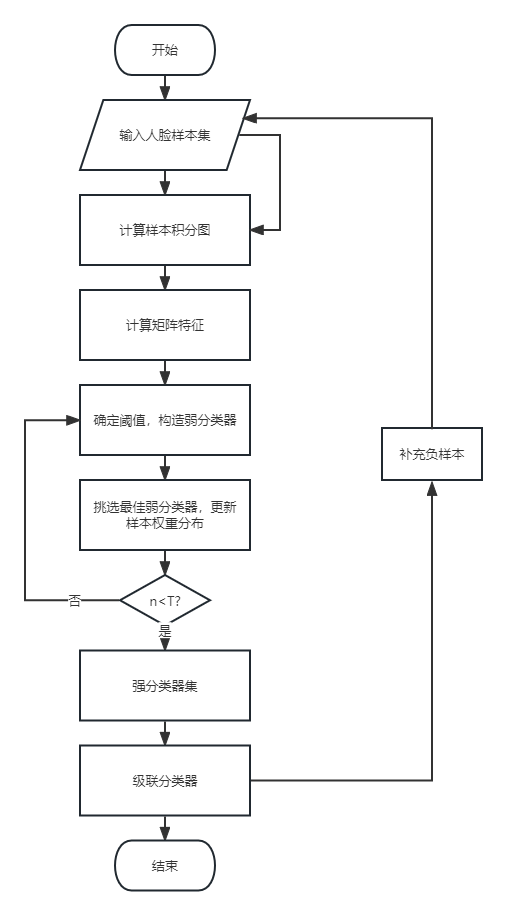
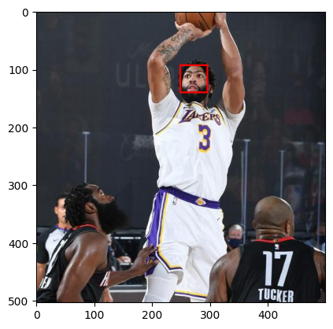
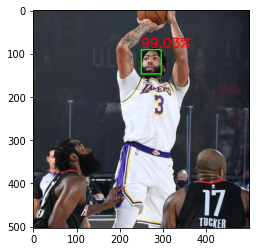
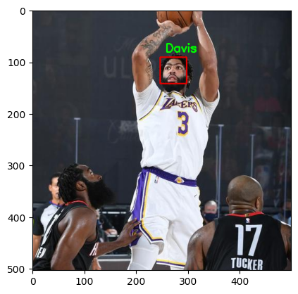
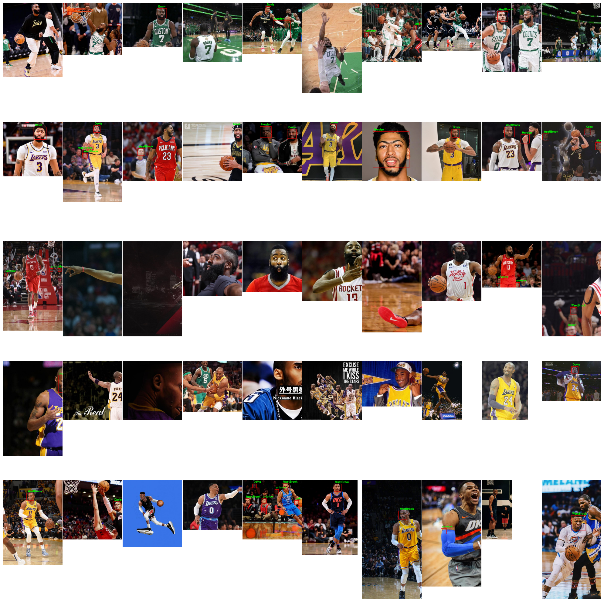
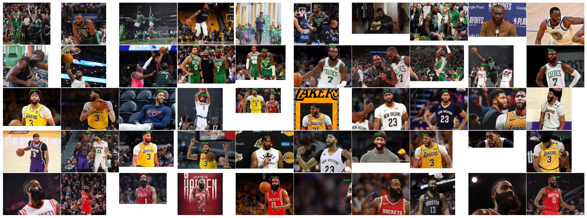

# Digital-Image-Process
数字图像处理课程的作业及人脸识别项目文件

## work

主要包含了数字图像处理了六次课程作业

1.  图像量化处理,图像的采样

2.  视频中截取相邻图片做差值,加法融合运算, `Gamma` 函数增强图片,`log` 变换,直方图均衡算法

3.  医学 X 图像的增强

4. 阈值分割,分水岭算法,硬币的分割

5. 图像加噪声及其去噪

6. 图像的傅里叶变换

## Project

数字图像处理课程的作业及人脸识别项目文件

**主要文件**:
> 1. `face_detect.ipynb`: 主文件
> 2. `protxtxt.ipynb`: 描述文件
> 3. `res10_300x300_ssd_iter_140000_fp16.caffemodel`: 基于`resnet10`训练好的网络权重文件
> 4. trainer.yml: 基于训练集得到的训练权重文件

要求：
>1. 可以识别 5 个人
>2. 对人脸进行画框
>3. 可以识别视频流

简介：

> 本项目基于`opencv`的中的人脸位置检测，主要是对网络上爬取的指定球星图片，学习其特征，然后对球星进行预测，其中的分类器采用`Harr` 分类器[^ 1 ]和基于`LBPH`特征[^2]的识别器


#### 2.设计流程


主要流程：

1. 基于要识别的类别进行数据集采集
2. 划分数据集
3. 制作数据集标签
4. 加载分类器
5. 训练识别器得到训练文件
6. 读取训练文件，对输入的图片进行预测

##### 数据集

1. 采用从网络上进行数据集的采集
   主要使用`requests`包在`https://image.baidu.com/`网站中爬取要求的 `keyword`类型图片
      

   数据集主要图片

   

2. 对数据集进行以 `2:1` 比例划分训练集和数据集
   数据集格式:

   ```
   dataset
      |
      |- trainset
      |        |--- class 1
      |        |--- class 2
      |        |--- class 3
      |        |--- class 4
      |        |--- class 5
      |- testset
      |        |--- class 1
      |        |--- class 2
      |        |--- class 3
      |        |--- class 4
      |        |--- class 5
   ```

3. 读取类别制作标签文件
   基于类别文件名称形成类别和id的字典

##### 数据的训练

主要流程



1. 加载原始的人脸识别分类器文件

   `opencv`提供预训练的`Harr`级联库(检测面部，左右眼，佩戴墨镜),此处主要目的是人脸检测故只需导入对应的`xml`文件即可  [下载地址](https://github.com/opencv/opencv/tree/master/data/haarcascades)

2. 读取训练集的图片

   在导入预训练文件之后，此时我们可以对图片中的人脸进行检测，但是为了实现更好的效果需要调整检测的参数 (`detectMultiScale(image,objects,scaleFactor,minNeighbors,flags,minSize,maxSize)`)

   - `image`：输入的图片
   - `objects`：表示检测到的人脸目标序列
   - `scaleFactor`：表示每次图像尺寸减小的比例
   - `minNeighbors`：表示每一个目标至少要被检测到3次才算是真的目标(因为周围的像素和不同的窗口大小都可以检测到人脸),
   - `minSize`：为目标的最小尺寸
   - `minSize`：为目标的最大尺寸

3. 针对数据集图片进行学习

   此时可以对图片中的人脸可以进行检测，但是并不能准确的预测到人的类别，所以使用训练集来将网上获取的五个类别图片进行训练，得到对应的训练文件，将其保存可用于图像的人脸预测


##### 预测数据

1. 先将图片转为灰度图
2. 加载`opencv`的分类器
3. 通过传入预测灰度图通过分类器的多目标检测函数得到对应的脸部坐标
4. 从原始图片中截取脸部图片
5. 识别器预测输入脸部图片，得到置信度和对应类别
6. 在原始预测图片中画框和文本信息

#### 3.输出关键模块的中间结果并解释

- 人脸检测

  基于`Harr`级分类器



SSD方式检测



- 人脸预测



#### 4.结果展示

测试集



训练集



#### 5.结果讨论（说明项目的大致精度，和适用的情况；说明在哪些情况下所给的解决方案可能会失败或者无效；项目有哪些将来可能改进或者提高的方面）

存在的问题

1. 有少数的人脸未能很好的识别，不能正确框出
2. 在训练集上识别效果尚可，但是在训练集上很多存在大量的错标情况

分析的原因

1. 照片是球员运动照，很多倾斜的角度拍照的图片会不易识别（将训练的数据集进行翻转，不仅达到增加数据集也能很好的适应不同角度的输入图片）
2. 训练的数据集数量不够，泛化效果不好


#### 6.可能的改进方向

本文人脸识别主要是基于传统的`Harr`级联检测器，可以使用`SSD`方式[^3]来提升人脸识别的效果 [描述文件](https://raw.githubusercontent.com/opencv/opencv/master/samples/dnn/face_detector/deploy.prototxt) 和[权重文件](https://raw.githubusercontent.com/opencv/opencv_3rdparty/dnn_samples_face_detector_20180205_fp16/res10_300x300_ssd_iter_140000_fp16.caffemodel)


> Harr是一种特征描述,主要分为边缘特征,线性特征，中心特征

1. 扩大数据集的数量，加大学习的数量

2. 调整人脸识别的置信度，间隔等参数


#### Conference:

[ 1 ] `https://github.com/SnowOnVolcano/ImageProcessing`

[ 2 ] `https://blog.csdn.net/qq_40985985/article/details/118254878`

[ 3 ] `https://blog.csdn.net/weixin_54627824/article/details/122077388`

[ 4 ] `https://github.com/TommyZihao/zihao_commercial`


---

#### 脚注

[^ 1 ]: `Harr` 分类器=`Harr-like`特征+`AdaBoost`算法+级联+积分图快速计算
[^2]: Local Binary Patterns Histograms 局部二进制编码直方图，建立在`LBPH`基础之上的人脸识别法基本思想如下：首先以每个像素为中心，判断与周围像素灰度值大小关系，对其进行二进制编码，从而获得整幅图像的`LBP`编码图像；再将`LBP`图像分为个区域，获取每个区域的`LBP`编码直方图，继而得到整幅图像的`LBP`编码直方图，通过比较不同人脸图像`LBP`编码直方图达到人脸识别的目的,其优点是不会受到光照、缩放、旋转和平移的影响。

[^3]: 调用 Caffe 框架使用训练好的残差网络进行人脸监测


